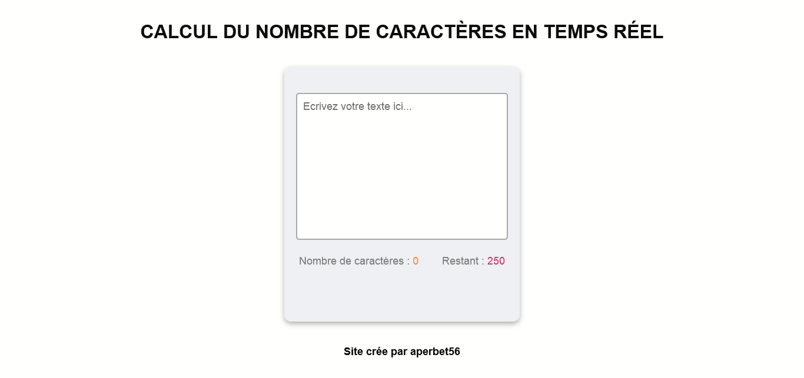

## CALCUL DU NOMBRE DE CARACTERES EN TEMPS REEL

## Le challenge

Projet qui permet à un internaute de saisir un texte de 250 caractères maximun.

- Spécifications techniques
  - affichage du le nombre de caractères saisi en temps réél
  - affichage du nombre de caractères restant à saisir (pour obtenir les 250 caractères) en temps réél
  - Projet responsive

## Démonstration

Lien vers le projet : https://aperbet56.github.io/real_time_character_counter/

## Projet développé avec

- Utilisation des balises sémantiques HTML5
- CSS3
- Flexbox
- Desktop first
- Page web responsive
- Utilisation d'un normaliseur : le fichier normalize.css
- JavaScript
- Code JavaScript commenté
